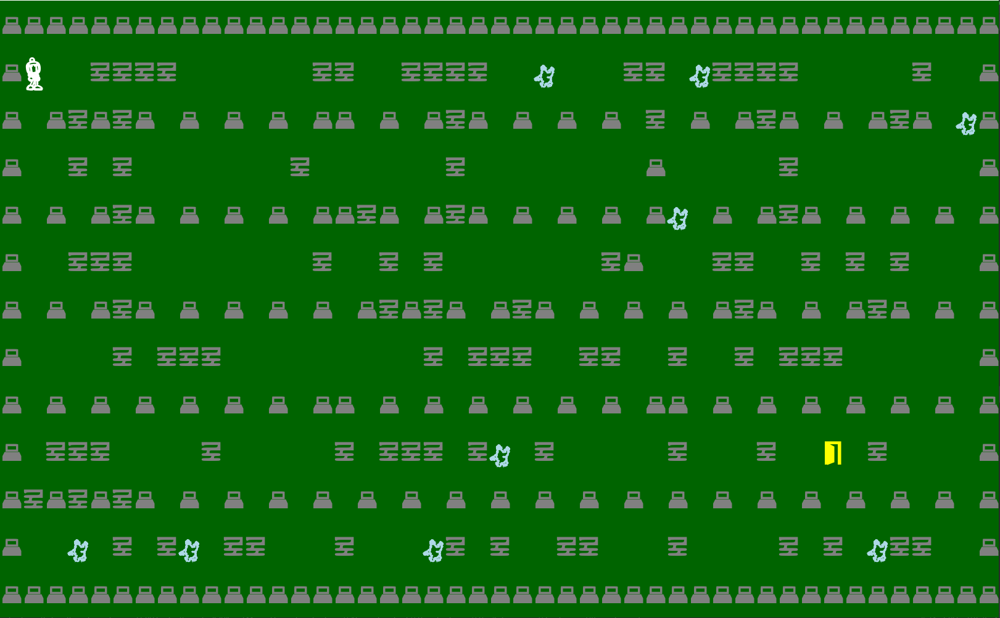
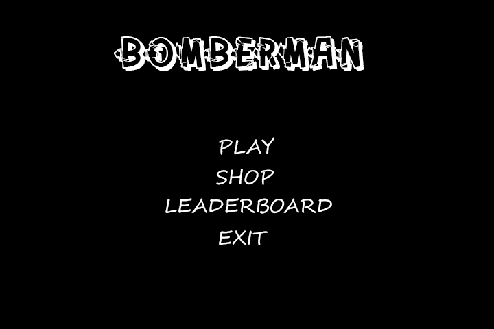
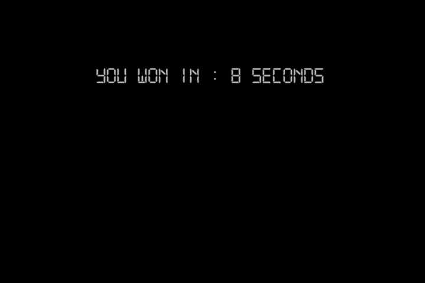
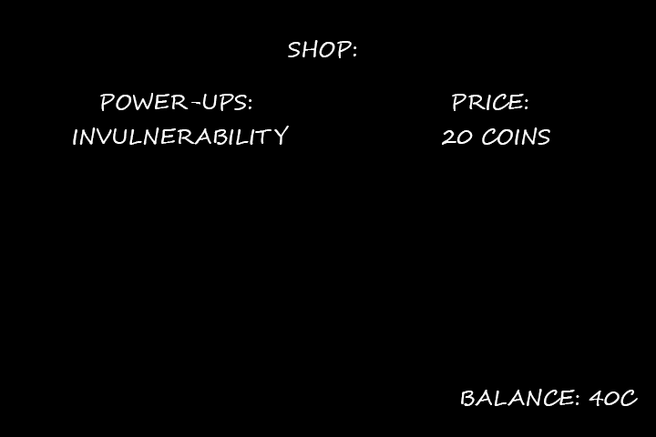

## LDTS<13><03> - <BOMBERMAN>
> Our game consists in a Hero, known as, Bomberman who has the ability to drop BOMBS which are able to destroy some types of blocks and also to KILL the enemies. By destroying the blocks you will be able to create a path leading to the door (EXIT) and then win the game. You can also win the game by killing every robot, be CAREFUL!
This game was developed by *Diogo Babo* (up202004950@fe.up.pt), *João Oliveira* (*up202004407@fe.up.pt) and *Ricardo Cavalheiro* (up202005103@fe.up.pt) for LDTS 2021/2022.

## For a more detailed version of this description click [here](./docs/README.md).
  
## Screenshots
  
The following mock-ups will illustrate how the game will look!
### Game preview

  
### Menus (to be implemented)

