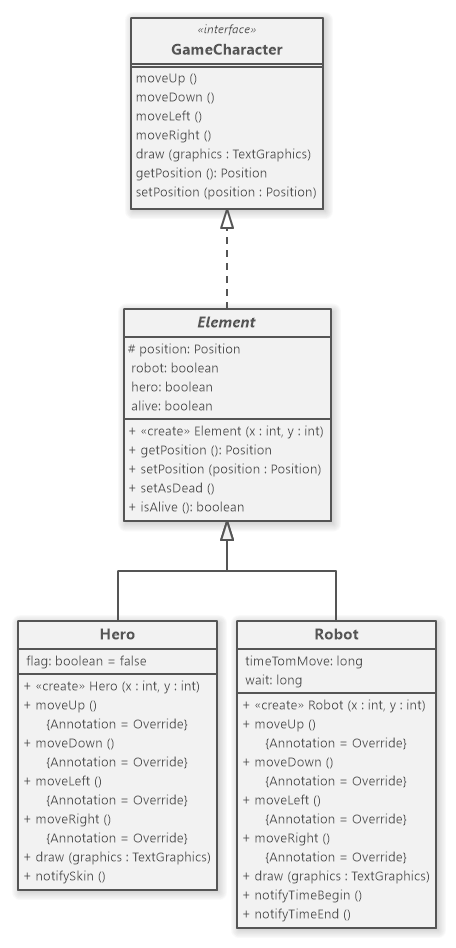

## LDTS<13><03> - BOMBERMAN

Our game consists in a Hero, known as, *Bomberman* who has the ability to drop *BOMBS* which are able to destroy some types of blocks and also to KILL the enemies. The Bomberman can collect *Coins* scattered around the map and use it to buy Power-Ups at the shop. At the Start of the Game your Balance is 10 Coins. By destroying the blocks you will be able to create a path leading to the door (EXIT) and then win the game. You can also win the game by killing every robot, be CAREFUL (*they are fast*)!

>This game was developed by *Diogo Babo* (up202004950@fe.up.pt), *João Oliveira* (up202004407@fe.up.pt) and *Ricardo Cavalheiro* (up202005103@fe.up.pt) for LDTS 2021/2022.

## Table of contents
1. [How to Play](#how-to-play)
2. [Implemented Features](#implemented-features)
3. [Game Preview](#game-preview)
4. [Design Patterns](#design)
5. [Code Smells](#known-code-smells-and-refactoring-suggestions)
6. [Testing](#testing)

## How to Play

You can move the character using
- `🔼` to go up
- `▶️` to go right
- `◀️` to go left
- `🔽️󠀠󠀠󠀠` to go down󠀠

Or you can use `Spacebar` to drop bombs that take 4 seconds to explode.

The main objective is to reach the Exit or destroy all Robots.

### IMPLEMENTED FEATURES

- **Main Menu** - Menu where you can Play the Game, go to the Shop, go to the Leaderboard, select the Difficulty or Exit the Game.
- **Pause Menu** - Pause Menu of the game where you can Resume the Game, go to the Shop or return to the Main Menu.
- **Game Over Menu** - Menu that depends on if you Win or Lose the Game where you can Play Again or return to the Main Menu.
- **Menu To Get Player Name** - Menu where the user types the `PLAYER` name.
- **Difficulty Options** - The Game has two Difficulties (Hard or Easy) that alters robots movement.
- **Shop** - Shop of the Game where you can Buy Power-Ups such as: Change Skin; Increase Speed; Slow Time; (Each One costs 5 Coins) 
- **Background, Menu and Pause Music** - The Game and both Pause and Main Menus have specific Musics.
- **Sound Effects** - Added a special sound effect for every interaction: Scrolling through Menu; Selecting an option; Choosing difficulty; Buying a Power-up or not having enough balance; Winning; Losing; Walking; Dropping and Exploding a Bomb; 
- **Bomberman Movement** - The game character (hero) will move depending on which arrow key is pressed (Up, Down, Left or Right).
- **Robots** - The map has Robots that move around the Map.
- **Robots Strategies** - Robots have two types of Strategies: RandomMovement - Robots move randomly; FollowHeroMovement - Robots chase the Bomberman;
- **Destructible and Indestructible Blocks** - There are two types of blocks, ones which can be destroyed by Bombs and the other that is indestructible;
- **Coins** - There are Coins scattered around the map that the Bomberman can get by walking to them.
- **Bomb and Explosion Particles** - The game character (hero) will drop a bomb where is he currently standing when the space bar is pressed. This bomb is able to destroy the non-concrete blocks but not the others. It is also capable of killing the robots. (The bomb has a time of 4s to explode, and a range of 4 blocks, be careful, don't too close to it!). Also added particles for the explosion to show the range of the Bomb.
- **Power-ups** - The Game has three Power-Ups that the Bomberman can buy at the shop, each one lasts 10 seconds: Change Skin - Hero changes the skin; Increase Speed - Hero moves faster; Slow Time - Robots move slower;
- **Exit Door** - There is A Door in the map where you can go to Win the Game.

### Game Preview

### DESIGN

#### Methods to Draw each class

- **Problem in Context :** One problem we knew from the start we had to deal with was the different methods we had to create to draw each class of the game(Ex: Hero, Robot, Blocks, Bomb).

- **Factory Method :** So we have applied the **Factory Method** pattern. **Element** is an abstract class that has an abstract **draw** method which is overridden by the Hero and Robot classes; that way when you are drawing the board it knows how to draw each class. We also did the same thing for the Concrete Blocks, Destructable Blocks and Bomb.

- **Implementation :** Element is an abstract class which is responsible for creating the moving elements of the board but only the subclasses know how to draw themselves.

These classes can be found in the following files:

- [Element](https://github.com/FEUP-LDTS-2021/ldts-project-assignment-g1303/blob/109d3ca525284eabda8cbbab17f4a8623753fc18/src/main/java/com/aor/Element/Element.java)
- [Hero](https://github.com/FEUP-LDTS-2021/ldts-project-assignment-g1303/blob/109d3ca525284eabda8cbbab17f4a8623753fc18/src/main/java/com/aor/Element/Hero.java)
- [Robot](https://github.com/FEUP-LDTS-2021/ldts-project-assignment-g1303/blob/109d3ca525284eabda8cbbab17f4a8623753fc18/src/main/java/com/aor/Element/Robot.java)

- **Consequences :**

The use of the Factory Method Pattern allows some benefits to the design:

- Removes the need to bind application-specific classes into your code. 
- You can construct objects step-by-step, defer construction steps or run steps recursively. 
- You can introduce new types of Elements into the program without changing existing code.

#### Diferents Strategies of a Robot

- **Problem in Context :** We wanted the Robots to have different ways of deciding where they wanna move in each step to make it harder for the user to win. 

- **Strategy Method :** We will use the **Strategy Pattern** to have different ways to move the Robot. 

- **Implementation :** *Not implemented yet*

These classes can be found in the following files:

- [___]()
- [___]()
- [___]()

**Consequences**

The advantages of using the Strategy Pattern are the following:

- You can switch algorithms used inside an object at runtime.
- Clean code because you avoid conditional-infested code.
- Open/Closed Principle. You can add new strategies to the Robot without having to change the context.

#### KNOWN CODE SMELLS AND REFACTORING SUGGESTIONS

#### **DATA CLASS**

The `Position` class is a **Data Class**, because it contains fields and not a lot of behavior. However, it is not a bad code smell as it a consequence of the design we choose. It allows you to understand and organize the code and the operations are now gathered in a single place, instead of throughout the code.

#### **SWITCH STATEMENTS**

We had the need to use several if's depending on the direction the hero chooses to go. The refactoring suggestion is to use polymorphism, but we don't find it wise in this case as the code gets far less readable.

#### **LARGE CLASS**

The `PlayingState` class contains many fields and long methods. We find it reasonable as it is the main class of the program and most of the methods don't really make sense to split into other classes.

### TESTING

### Screenshot of coverage report

### Link to mutation testing report
[Mutation tests](../Pitest/index.html)

### SELF-EVALUATION

> In this section describe how the work regarding the project was divided between the students. In the event that members of the group do not agree on a work distribution, the group should send an email to the teacher explaining the disagreement.

- Diogo Babo: 33.3%
- João Oliveira: 33.3%
- Ricardo Cavalheiro: 33.3%
- Bruno Lima: 0.1%
